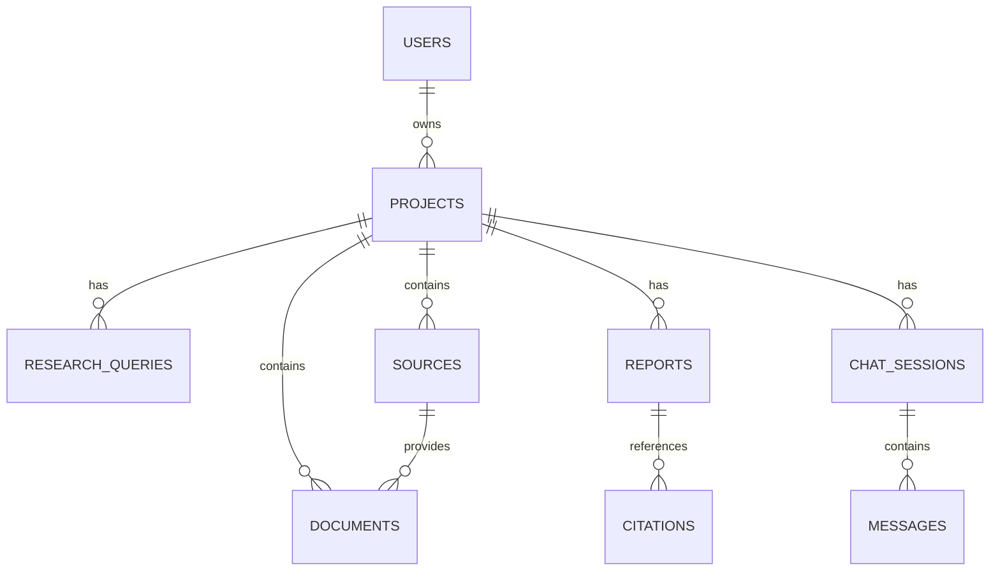

# Database Schema

## Overview

This document describes the primary relational schema for the Res-GPT research platform: users, projects, research queries, sources, documents, reports, and chat sessions.

> Conventions: `id` fields are primary keys (UUID or serial), timestamps use `created_at` / `updated_at`, and foreign keys are suffixed with `_id`.

## Tables

### users
| Column | Type | Constraints | Description |
|---|---|---|---|
| id | UUID / serial | PK | User identifier |
| name | text | NOT NULL | Display name |
| email | text | UNIQUE, NOT NULL | Login email |
| password_hash | text | NOT NULL | Hashed password |
| created_at | timestamptz | DEFAULT now() | Record creation time |
| updated_at | timestamptz | DEFAULT now() | Last update time |

### projects
| Column | Type | Constraints | Description |
|---|---|---|---|
| id | UUID / serial | PK |
| user_id | UUID | FK -> users(id), NOT NULL | Owner of the project |
| title | text | NOT NULL |
| description | text | |
| status | text | (e.g. active, archived) |
| created_at | timestamptz | DEFAULT now() |
| updated_at | timestamptz | DEFAULT now() |

### research_queries
| Column | Type | Constraints | Description |
|---|---|---|---|
| id | UUID / serial | PK |
| project_id | UUID | FK -> projects(id), NOT NULL |
| query | text | NOT NULL | Original user query |
| status | text | (queued, running, done, failed) |
| created_at | timestamptz | DEFAULT now() |

### sources
| Column | Type | Constraints | Description |
|---|---|---|---|
| id | UUID / serial | PK |
| project_id | UUID | FK -> projects(id), NOT NULL |
| title | text | |
| url | text | |
| author | text | |
| published_date | date | |
| credibility_score | numeric | Optional credibility metric |
| summary | text | Short cached summary |
| created_at | timestamptz | DEFAULT now() |

### documents
| Column | Type | Constraints | Description |
|---|---|---|---|
| id | UUID / serial | PK |
| project_id | UUID | FK -> projects(id), NOT NULL |
| source_id | UUID | FK -> sources(id) | Source for the document |
| content | text | Full scraped or uploaded content |
| embedding_status | text | (pending, indexed, failed) |
| created_at | timestamptz | DEFAULT now() |

### reports
| Column | Type | Constraints | Description |
|---|---|---|---|
| id | UUID / serial | PK |
| project_id | UUID | FK -> projects(id), NOT NULL |
| title | text | |
| markdown_path | text | Path in object storage |
| pdf_path | text | Optional PDF export path |
| docx_path | text | Optional DOCX export path |
| created_at | timestamptz | DEFAULT now() |

### chat_sessions
| Column | Type | Constraints | Description |
|---|---|---|---|
| id | UUID / serial | PK |
| project_id | UUID | FK -> projects(id), NOT NULL |
| created_at | timestamptz | DEFAULT now() |

### messages
| Column | Type | Constraints | Description |
|---|---|---|---|
| id | UUID / serial | PK |
| chat_session_id | UUID | FK -> chat_sessions(id), NOT NULL |
| role | text | (user, system, assistant) |
| content | text | Message content |
| created_at | timestamptz | DEFAULT now() |

### citations
| Column | Type | Constraints | Description |
|---|---|---|---|
| id | UUID / serial | PK |
| report_id | UUID | FK -> reports(id), NOT NULL |
| source_id | UUID | FK -> sources(id), NOT NULL |
| citation_text | text | Formatted citation |
| created_at | timestamptz | DEFAULT now() |

## Relationships (ER)



## Indexes & Notes

- Index common lookup columns: `projects(user_id)`, `research_queries(project_id)`, `documents(source_id)`, `messages(chat_session_id)`.
- Store embeddings separately in a vector DB (Qdrant) and reference documents by `document_id`.
- Keep heavy text (raw content) in object storage if needed and store paths in `documents.content_path` (optional).
- Use cascading deletes carefully: deleting a `project` may cascade to `research_queries`, `sources`, `documents`, and `reports`.

## Example: recommended CREATE TABLE (Postgres)

```sql
CREATE TABLE users (
  id UUID PRIMARY KEY DEFAULT gen_random_uuid(),
  name text NOT NULL,
  email text UNIQUE NOT NULL,
  password_hash text NOT NULL,
  created_at timestamptz DEFAULT now(),
  updated_at timestamptz DEFAULT now()
);
```
