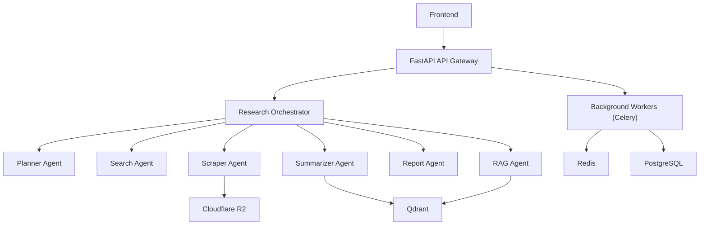

# Architecture Document

## High-Level Architecture

- Frontend
  - FastAPI API Gateway
  - Research Orchestrator
    - Planner Agent
    - Search Agent
    - Scraper Agent
    - Summarizer Agent
    - Report Agent
    - RAG Agent

### Infrastructure

- PostgreSQL (relational database)
- Qdrant (vector database)
- Redis (cache)
- Cloudflare R2 (file/object storage)

## Research Flow

1. User submits a query
2. Research Planner generates a plan
3. Search Agent searches websites and sources
4. Scraper Agent extracts content
5. Summarizer Agent creates concise summaries
6. Store embeddings in Qdrant
7. Report Agent generates final report
8. User interacts / chats with Research Services

## Services and Components

- **API Service:** FastAPI
- **Background Workers:** Celery
- **Database:** PostgreSQL
- **Vector DB:** Qdrant
- **Cache:** Redis
- **File Storage:** Cloudflare R2

## Notes

- The Research Orchestrator coordinates agents and workers.
- RAG Agent combines retrieval (Qdrant) with generation for contextual responses.
- Embeddings are stored in Qdrant and relational metadata in PostgreSQL.
